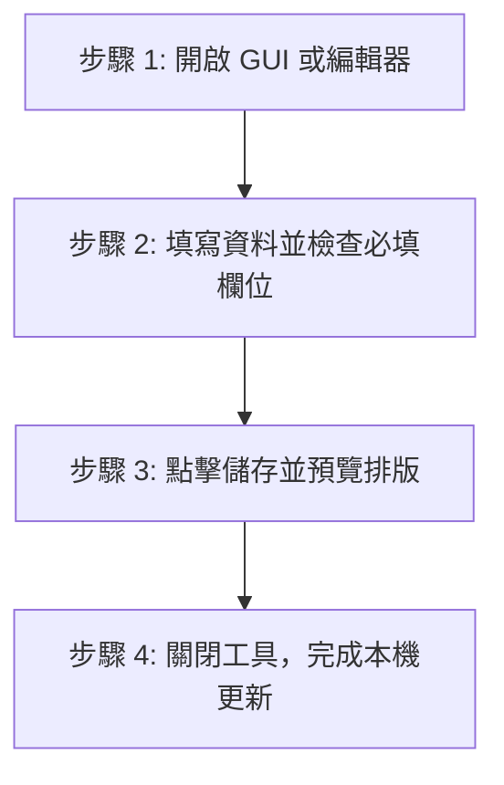

# 網站內容編輯者操作手冊（寶寶級指南）

歡迎來到網站編輯團隊！這是一份專為**非工程師、內容創作者與編輯者**設計的「零門檻」操作手冊。
您不需要了解底層程式碼或終端機指令，只要按照本手冊指引，即可輕鬆新增、修改小說章節、角色設定、百寶閣道具與世界觀檔案。

---

## ⚡ 5 秒極速上手：三大桌面捷徑

在專案資料夾根目錄下，我們為您準備了專屬的桌面腳本，點擊即可開啟：

| 捷徑名稱 | 適用情境 | 核心功能 |
| :--- | :--- | :--- |
| **`開啟控制台.bat`** | 🗂️ **全功能後台管理** | 新增/修改/刪除所有設定集（角色、道具、小說）、批次匯入小說章節、分類管理 |
| **`預覽文字編輯器.bat`** | ✍️ **專注寫作與即時預覽** | 左右分屏即時預覽 Markdown 排版、字數統計、快速搜尋各章節與草稿 |
| **`一鍵同步字庫.bat`** | 📚 **古典辭典與字庫同步** | 自動檢測並更新古典字庫與辭典資料庫，確保詞彙查詢與檢驗模組正常 |

---

## 🗺️ 可編輯文本全地圖（Content Map）

所有前台網站展示的內容，全部集中存放在 `src/content/` 資料夾內。
以下為 12 大內容分類與存放路徑對照表：

```text
src/content/
├── 📖 novels/          # 小說主作品檔（書名、簡介、封面、連載狀態）
├── 📑 novel_chapters/  # 小說章節內容（各卷各章本文、章節序號、字數）
├── 👤 characters/      # 人物誌 / 角色檔案（立繪、陣營、性格、生平）
├── 🏰 factions/        # 門派與勢力（門派背景、宗門規條、勢力範圍）
├── 🗡️ items/           # 百寶閣 / 道具裝備（神兵、丹藥、法寶品階）
├── 🔥 techniques/      # 功法與武學（心法秘笈、招式名稱、修煉門檻）
├── 📜 worldview/       # 世界觀設定（修煉體系、歷史紀年、地理疆域）
├── 🐉 bestiary/        # 異獸志 / 神魔異獸（異獸圖鑑、棲息地、危險等級）
├── 🏛️ guoxue/          # 國學與典籍（經史子集、古籍引用、注釋）
├── 📚 dictionary/      # 專有名詞辭典（術語表、世界觀特有詞彙釋義）
├── 🎨 works/           # 創作與多媒體作品（插畫、影音展示、外傳）
└── ✍️ blog/            # 站長隨筆與公告（最新消息、版本更新紀錄）
```

> [!TIP]
> **編輯建議**：強烈建議優先使用 **`開啟控制台.bat`** 或 **`預覽文字編輯器.bat`** 來編輯上述檔案，工具會自動處理格式與元數據（Frontmatter），避免因格式錯誤導致網站建置失敗。

---

## 🖥️ GUI 視覺化工具操作指南

### 1. 【網站管理控制台】（`開啟控制台.bat`）

此工具是網站的主力管理後台，雙擊執行後會自動開啟深色風格管理視窗。


#### 📌 日常操作三步驟

1. **選擇分類**：在左上方下拉選單切換至欲編輯的類別（例如：`characters` 角色 或 `items` 道具）。
2. **選取或新增**：點選左側清單中的現有項目進行修改；或點擊 `[＋ 新增項目]` 填寫必要欄位。
3. **儲存變更**：編輯完成後，請務必點擊右下方 **`[💾 儲存變更]`**（或使用快捷鍵 `Ctrl + S`）。

---

### 2. 【即時預覽文字編輯器】（`預覽文字編輯器.bat`）

專為文章與小說創作者打造，提供「左側編輯、右側即時渲染」的寫作體驗。

#### 📌 核心功能亮點

* **即時排版預覽**：支援標準 Markdown 語法、標題階層、引文、清單與強調標記。
* **即時字數統計**：底欄即時顯示目前文章的總字數、段落數與閱讀預估時間。
* **快速切換章節**：左側側邊欄自動索引所有章節，點擊即可無縫切換。
* **安全存檔機制**：支援快捷鍵 `Ctrl + S` 快速存檔，並自動保持 UTF-8 編碼。

---

## 🛑 紅線禁區：請勿隨意手動修改的檔案

為了保護網站正常運作，以下為**系統核心設定檔**，非工程師請勿手動編輯或更名：

| 檔案 / 目錄路徑 | 為什麼不能碰？ |
| :--- | :--- |
| `src/content/config.ts` | 系統欄位規則定義檔，改動會導致全站資料結構驗證崩潰。 |
| `scripts/schema.json` | GUI 與後端結構同步索引檔，由系統自動生成。 |
| `astro.config.mjs` | 網站引擎核心配置，包含路由與編譯外掛。 |
| `.git/` 與 `.github/` | 版本控制與自動化部署流水線目錄。 |
| `package.json` | 系統軟體套件清單。 |

---

## 🛡️ 標準發布作業程序（SOP）

當您完成一篇新文章或更新角色資料後，請遵循以下 4 個步驟：



1. **編寫內容**：透過 `開啟控制台.bat` 或 `預覽文字編輯器.bat` 進行文字撰寫。
2. **驗證格式**：確認標題、封面圖路徑、必要欄位均已填寫完畢。
3. **本機儲存**：按下 `Ctrl + S` 或點擊儲存按鈕，確認狀態列顯示「儲存成功」。
4. **提交同步**：若團隊有配置自動同步或由站長統一推送，關閉編輯器即可。

---

## ❓ 常見問題自救指南（FAQ）

### Q1：點擊 `.bat` 腳本後黑視窗閃一下就消失了？

* **可能原因**：電腦尚未安裝 Python 或環境變數未設定。
* **解決方式**：請聯繫技術人員協助安裝 Python 3.10+ 並勾選「Add Python to PATH」。

### Q2：圖片上傳後在前台沒有顯示？

* **可能原因**：圖片未放置於正確路徑，或路徑大小寫不符。
* **解決方式**：請確認圖片檔案存放於 `public/` 目錄中，並以 `/檔名.png`（斜線開頭）進行引用。

### Q3：編輯完 Markdown 後儲存，前台文字出現亂碼？

* **可能原因**：使用了不支援 UTF-8 編碼的文字編輯軟體（如 Windows 內建舊版記事本）。
* **解決方式**：請一律使用 `預覽文字編輯器.bat` 或 VS Code 開啟，並確認右下角編碼為 `UTF-8`。
